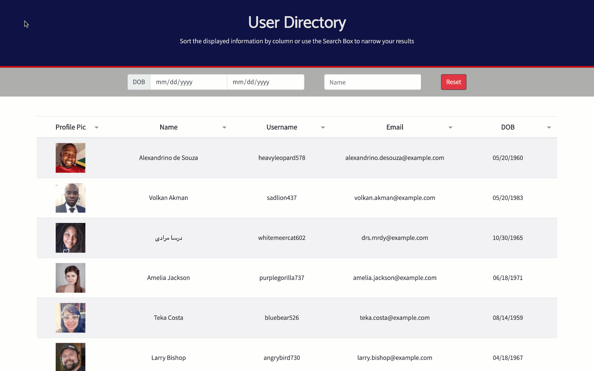

# User Directory

This app allows users to view an entire user directory at once so that they have quick access to their information. The data displayed can be narrowed down by range of date of birth and by user's first name; it can also be sorted by column (i.e., name, username, email, and date of birth)

